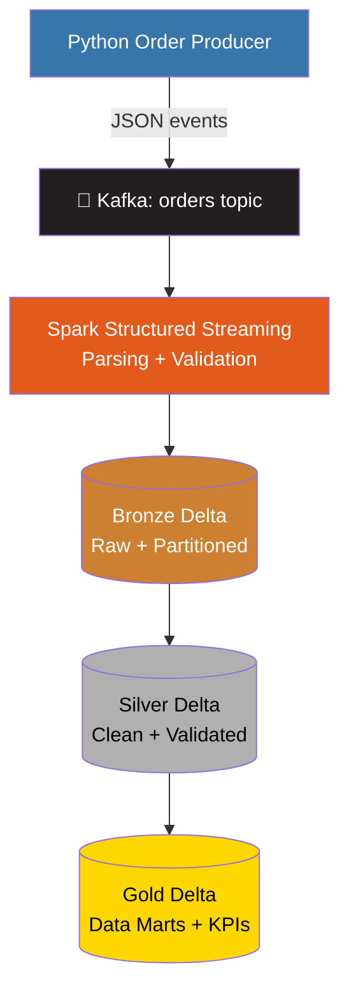
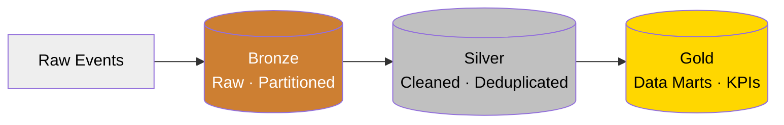

<div align="center">

# 🛒 On-Premise Real-Time Retail Data Engineering Platform

**A production-style streaming lakehouse — from raw Kafka events to business-ready Gold data marts.**


</div>

---

##  Table of Contents

- [Overview](#-overview)
- [Architecture](#-architecture)
- [Tech Stack](#-tech-stack)
- [Data Flow](#-data-flow)
- [Medallion Architecture](#-medallion-architecture)
- [Incremental Processing](#-incremental-processing)
- [Project Structure](#-project-structure)
- [Getting Started](#-getting-started)
- [Key Concepts Demonstrated](#-key-concepts-demonstrated)
- [Analytics Enabled](#-analytics-enabled)
- [Roadmap](#-roadmap)

---

##  Overview

This project simulates a **continuous stream of e-commerce order events** and processes them through a real, on-premise streaming architecture — the same patterns used in production retail data platforms, just running locally with Docker.

**Apache Kafka** streams live order events → **Spark Structured Streaming** ingests and validates them in real time → **Delta Lake** organizes the data into a clean **Bronze → Silver → Gold Medallion architecture**, producing analytics-ready data marts.

>  Think of it as a mini version of what Uber, Netflix, or Amazon run internally — just scoped down to run on your own machine.

---

## Architecture



---

## Tech Stack

| Category            | Technologies                 |
|----------------------|-------------------------------|
|  Language          | Python                        |
|  Streaming         | Apache Kafka                  |
|  Processing         | Apache Spark, PySpark         |
|  Stream Processing | Spark Structured Streaming    |
|  Data Lake          | Delta Lake, Parquet           |
|  Infrastructure     | Docker                        |
|  OS                 | Linux / Ubuntu / WSL          |
|  Version Control    | Git / GitHub                  |

---

##  Data Flow

<details>
<summary><b>1. Event Generation</b> — click to expand</summary>

A Python producer continuously generates synthetic e-commerce order events containing:

- Order ID, Customer ID, Product ID, Seller ID
- Customer city/state
- Price, freight value
- Payment type/value
- Order status
- Event timestamp

Events are serialized as JSON and published to the Kafka `orders` topic.

</details>

<details>
<summary><b>2. Kafka Streaming</b> — click to expand</summary>

Kafka acts as the event streaming backbone between the producer and Spark:

```text
Producer → Kafka → Spark
```

A Kafka console consumer was used during development to validate events were reaching the topic in real time.

</details>

<details>
<summary><b>3. Bronze Layer</b> — click to expand</summary>

Spark Structured Streaming continuously consumes the Kafka topic and parses incoming JSON records into a **partitioned Bronze Delta table**.

Partitioned by:
```text
event_date
event_hour
```

Spark checkpointing maintains streaming progress and supports reliable incremental ingestion.

</details>

<details>
<summary><b>4. Silver Layer</b> — click to expand</summary>

Bronze data is transformed into a clean, trustworthy Silver layer:

-  Timestamp conversion
-  Duplicate order removal
-  Invalid price/payment filtering
-  Null validation
-  City whitespace cleanup & state standardization
-  Event date/hour derivation
-  Processing timestamp generation

Incremental processing avoids reprocessing previously handled Bronze data.

</details>

<details>
<summary><b>5. Gold Layer</b> — click to expand</summary>

Silver data is transformed into business-oriented analytical data marts:

```text
daily_sales • hourly_sales • kpi_summary • order_status
payment_method • product_sales • sales_by_state • top_products
```

These support analysis of revenue, order volume, AOV, hourly trends, product performance, payment methods, order status, state-level sales, and operational KPIs.

</details>

---

##  Medallion Architecture



---

## Incremental Processing

| Mechanism | What it does |
|---|---|
| **Kafka Offsets** | Tracks record position within each partition |
| **Spark Checkpointing** | Persists streaming progress for crash recovery |
| **Delta Transaction Log** (`_delta_log/`) | Tracks table versions and file changes |
| **Processing Metadata** | Prevents reprocessing already-handled Bronze partitions |

---

##  Project Structure

```text
PowerBI/
│
├── producer/
│   └── order_producer.py
│
├── spark/
│   ├── stream_consumer.py
│   ├── bronze_to_silver.py
│   └── ...
│
├── bronze_delta/
├── silver_delta/
│
├── gold/
│   ├── daily_sales/
│   ├── hourly_sales/
│   ├── kpi_summary/
│   ├── order_status/
│   ├── payment_method/
│   ├── product_sales/
│   ├── sales_by_state/
│   └── top_products/
│
├── checkpoint/
│   └── bronze_orders/
│
└── README.md
```

---

##  Getting Started

```bash
# 1. Start Kafka (via Docker)
docker compose up -d

# 2. Start the producer — streams synthetic orders
python3 producer/order_producer.py

# 3. Start Spark streaming — Kafka → Bronze Delta
python3 spark/stream_consumer.py

# 4. Run Silver processing — clean + validate
python3 spark/bronze_to_silver.py

# 5. Generate Gold data marts — analytics-ready output
python3 spark/silver_to_gold.py
```

> Gold datasets are now ready for downstream analysis, dashboards, or your BI tool of choice.

---

##  Key Concepts Demonstrated

<table>
<tr>
<td>

- Real-time event streaming
- Kafka producer/consumer architecture
- Spark Structured Streaming
- Checkpoint-based stream recovery
- Delta Lake & transaction logs

</td>
<td>

- Medallion architecture
- Incremental processing & partitioning
- Schema parsing & validation
- Deduplication & data cleansing
- KPI aggregation & data marts

</td>
</tr>
</table>

---

##  Analytics Enabled

| Domain | Metrics |
|---|---|
|  **Sales** | Total revenue, total orders, average order value, hourly trends |
|  **Products** | Top-performing products, product-level sales |
|  **Geography** | State-level sales, geographic performance |
|  **Payments** | Payment method distribution, payment-based sales |
|  **Operations** | Order status, order volume, operational KPIs |

---

## Roadmap

- [ ] Apache Airflow orchestration
- [ ] AWS S3 data lake
- [ ] AWS Glue / Athena
- [ ] Terraform infrastructure-as-code
- [ ] Multiple Kafka topics
- [ ] Docker Compose full-stack deployment
- [ ] Cloud deployment
- [ ] CI/CD pipeline
- [ ] Automated data quality monitoring
- [ ] Kubernetes orchestration
- [ ] Downstream analytics/BI serving layer

---

<div align="center">

** If you found this project interesting, consider starring the repo!**

</div>
